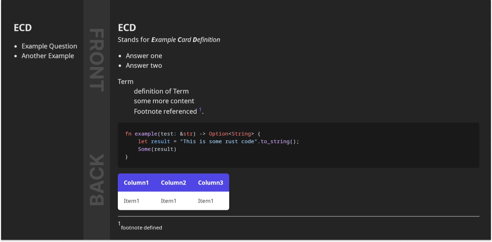

# Cardinal

Cardinal is an app designed to streamline the process of transforming textbooks
into knowledge. Unlike typical flashcard apps that require you to create and
manage each card individually through a UI, Cardinal offers a more efficient
approach: defining cards directly within your markdown files.

1. Card title: H1 `# Title`
2. Front page: Content following the first H2 `## Some irrelevant string`
3. Back page: Content following the second H2 `## Some irrelevant string`

This approach lets you use your favorite text editor—like Nvim—to create and
edit cards in the most efficient and flexible way possible.

> [!WARNING]
> This project is still in the early stages of development

## Features

- Strikethrough, Italics, Underline, and Bold
- Tables
- Lists (ul, ol)
- Code blocks
- Definition lists
- Footnotes
- Horizonal Rules
- GFM (GitHub Flavored Markdown features)

## Example

<div align="center" style="text-align:center; border-radius:10px;">
    <picture>
        
    </picture>
</div>

While the example is more complex than a typical flashcard, it can still be
defined quickly and concisely in this format:

````markdown
# ECD

## Front

- Example Question
- Another Example

## Back
Stands for ***E****xample* ***C****ard* ***D****efinition*      

- Answer one
- Answer two

Term
: definition of Term
: some more content
: Footnote referenced [^1].

```rust
fn example(test: &str) -> Option<String> {
    let result = "This is some rust code".to_string();
    Some(result)
}
```

| Column1 | Column2 | Column3 |
| ------------- | -------------- | -------------- |
| Item1 | Item1 | Item1 |

---
[^1]: footnote defined
````
